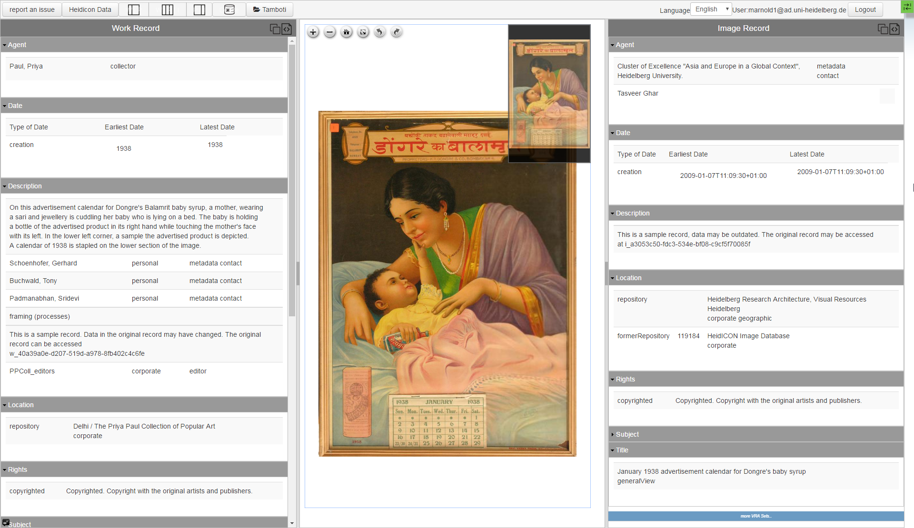

# Ziziphus - a VRA Core 4 XML metadata editor

Ziziphus was conceptualised by the Visual Resources team of the [Heidelberg Research Architecture](http://hra.uni-hd.de). It is a web based editor for descriptive image metadata in VRA Core 4 XML. Its form based interface offers a simple way to edit VRA XML metadata without having to learn and write XML. VRA core 4 was chosen for its high description precision: for example, the schema clearly distinguishes between metadata describing the physical work and metadata describing the images that depict it. By storing metadata in standardized XML it can be shared and re-used.

Ziziphus user interface.

Ziziphus features a number of auto-complete functions that allow editors to easily find and assign records from international controlled vocabularies and authoritative lists like the Getty Thesauri (AAT, TGN, ULAN, CONA), VIAF, or GND, to enhance metadata quality and reduce the chance of input errors. To adopt the schema for Transcultural Studies a small number of VRA Schema extensions were implemented, e.g. for multilingual metadata, alternative date notations, or authors of descriptions. The editor and its schema extensions were introduced to the VRA community at the [VRA 32nd Annual Conference](https://www.slideshare.net/MatthiasArnold/vr-acore-unboundarnold20140313public), Milwaukee, WI, March 2014. Ziziphus can be used with different image services, e.g. a IIIF image service. The editor has been developed in cooperation with [eXist Solutions](http://existsolutions.com). In late 2016 we began the conceptualisation and development of [Ziziphus2](), a new version of the editor that uses HTML5 / JavaScript and the open source Polymer 2 library instead of XForms, cf. [Ziziphus 2.0 - rethinking VRA editing](https://github.com/exc-asia-and-europe/ziziphus2/wiki#ziziphus-20---rethinking-vra-editing). 

Ziziphus was realized an eXist-DB app.

(update 2020-06-19ma)

# Installation

1. git clone this repository
2. call 'ant xar' to create the xar application
3. import a dataset into the database under the collection 'db/apps/ziziphusData. A working data set (Priya Paul collection) can also be found under https://github.com/betterFORM/zizphusData.git. To install this clone the repository and call ant xar in the root of the resulting working dir. This will create a data xar that works with the application.
4. install the xar application into eXist using the package manager from the dashboard of eXist.
5. clicking the Ziziphus icon opens an overview page listing the existing dataset. By clicking a link on the left the corresponding record will be opened.

Note:
Starting with version 0.6 you'll need to update the betterform.jar in eXist as it contains improvements that are needed for Ziziphus.

To do so follow these steps:

1. find your eXist installation
2. cd into the extensions/betterform/main/lib directory and copy the betterform.jar from the 'lib' directory of your ziziphus workspace to this location.

